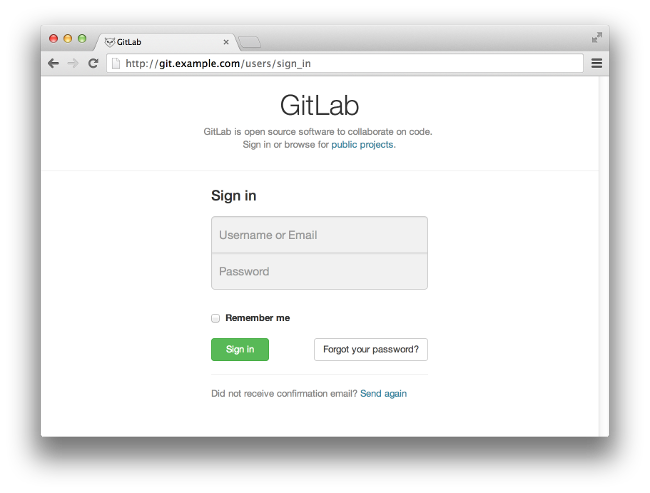

git config --global user.name "aliffathon"
git config --global user.email "fathon.1994@gmail.com"

-----------------------------------------------------------------------------
# 1. update system
sudo apt-get update
sudo apt-get upgrade

# 2. add user for gitlab
sudo adduser --disabled-login --gecos 'GitLab' git

---------------

Install Packages & Deps
1. Install Ruby to Compile
$ sudo apt-get install build-essential cmake zlib1g-dev libyaml-dev libssl-dev libgdbm-dev libreadline-dev libncurses5-dev libffi-dev curl openssh-server redis-server checkinstall libxml2-dev libxslt-dev libcurl4-openssl-dev libicu-dev logrotate

2. Install git
$ sudo apt-get install git

3. to receive email
$ sudo apt-get install postfix

---------------
Setup Ruby Env
1. Remove old Ruby
$ sudo apt-get remove ruby

2. Install ruby 2.1.2
$ mkdir /tmp/ruby && cd /tmp/ruby
$ wget -c http://ftp.ruby-lang.org/pub/ruby/2.1/ruby-2.1.2.tar.gz
$ tar -xvzf ruby-2.1.2.tar.gz
$ cd ruby-2.1.2
$ ./configure --disable-install-rdoc --prefix=/usr/local
$ make
$ sudo make install

3. Check installation
$ ruby -v

-------------
Setup PostgreSQL
1. Install PostgreSQL
$ sudo apt-get install postgresql postgresql-client libpq-dev

2. create new database and new user
$ sudo -u postgres createuser --createdb git
$ sudo -u postgres createdb --owner=git gitlab_production

3. connect to new database
$ sudo -u git -H psql -d gitlab_production -c "SELECT VERSION()"
  version 9.3.4 on 64bit machine

-------------
Installing GitLab
1. Install on Parent Home folder
$ cd /home/git

2. Download gitLab source
$ sudo -u git -H git clone https://gitlab.com/gitlab-org/gitlab-ce.git -b 6-9-stable gitlab
$ cd gitlab

3. Create GitLab config file
$ sudo -u git -H cp config/gitlab.yml{.example,}
$ gksudo gedit config/gitlab.yml (/home/git/gitlab/config/gitlab.yml)
	production: &base
		gitlab:
			host: git.aliffathon.net
			port: 80
			https: false
			email_from: gitlab@aliffathon.net
			support_email: support@aliffathon.net
$ gksudo gedit config/database.yml; add "gitlab_production"

4. Allow write for GitLab to log/ and tmp/
$ sudo chown -R git {log,tmp}
$ sudo chmod -R u+rwX {log,tmp,tmp/pids,tmp/sockets,public/uploads}

5. Create dir for satelittes
$ sudo -u git -H mkdir /home/git/gitlab-satelittes
$ sudo chmod u+rwx,g+rx,o-rwx /home/git/gitlab-satelittes

6. Create Unicorn, Rack attack & PostgreSQL conf files
$ sudo -u git -H cp config/unicorn.rb{.example,}
$ sudo -u git -H cp config/initializers/rack_attack.rb{.example,}
$ sudo -u git cp config/database.yml{.postgresql,}

7. database file should only readable by git
$ sudo -u git -H chmod o-rwx config/database.yml

8. Install gems
$ sudo gem install bundler
$ sudo -u git -H bundle install --deployment --without development test mysql aws

9. Install GitLab shell, ssh access & repo management
$ sudo -u git -H bundle exec rake gitlab:shell:install[v1.9.4] REDIS_URL=redis://localhost:6379 RAILS_ENV=production

10. open GitLab shell config
$ sudo nano /home/git/gitlab-shell/config.yml

11. check value of "gitlab_url"
	user: git
	gitlab_url: http://git.aliffathon.net/
	https_settings:
		self_signed_cert: false
	repos_path: "/home/git/repositories/"
	auth_file: "/home/git/.ssh/authorized_keys"
	redis:
		bin: "/usr/bin/redis-cli"
		host: localhost
		port: 6379
		namespace: resque:gitlab
	log_level: INFO
	audit_usernames: false

12. Init database & activate advance features
$ sudo -u git -H bundle exec rake gitlab:setup RAILS_ENV=production
	This will create the necessary database tables and seed the database.
	You will lose any previous data stored in the database.
	Do you want to continue (yes/no)? yes

13. Install init script to start on boot GitLab
$ sudo cp lib/support/init.d/gitlab /etc/init.d/gitlab
$ sudo update-rc.d gitlab defaults 21

14. setup logrotate
$ sudo cp lib/support/logrotate/gitlab /etc/logrotate.d/gitlab

15. check application status
$ sudo -u git -H bundle exec rake gitlab:env:info RAILS_ENV=production

Sample output

System information
System:         Ubuntu 14.04
Current User:   git
Using RVM:      no
Ruby Version:   2.1.2p95
Gem Version:    2.2.2
Bundler Version:1.6.3
Rake Version:   10.3.1
Sidekiq Version:2.17.0

GitLab information
Version:        6.9.2
Revision:       e46b644
Directory:      /home/git/gitlab
DB Adapter:     postgresql
URL:            http://git.example.com
HTTP Clone URL:	http://git.example.com/some-project.git
SSH Clone URL:	git@git.example.com:some-project.git
Using LDAP:     no
Using Omniauth: no

GitLab Shell
Version:        1.9.4
Repositories:   /home/git/repositories/
Hooks:          /home/git/gitlab-shell/hooks/
Git:            /usr/bin/git    

16. Compile Asset
$ sudo -u git -H bundle exec rake assets:precompile RAILS_ENV=production

17. Config Global settings
$ sudo -u git -H git config --global user.name "GitLab"
$ sudo -u git -H git config --global user.email "gitlab@aliffathon.net" (config/gitlab.yml)
$ sudo -u git -H git congig --global core.autoclrf input

18. Start GitLab
$ sudo service gitlab start

-----------------------

Set Up Nginx Virtual Host for GitLab

Nginx is the only supported web server for GitLab. In this section, you will create a new virtual host for GitLab and activate the site.

1. Install Nginx if you haven’t installed it:
$ sudo apt-get install nginx

2. Copy the sample site config:
$ sudo cp lib/support/nginx/gitlab /etc/nginx/sites-available/gitlab

3. Open the config file:
$ sudo nano /etc/nginx/sites-available/gitlab
Modify the value for server_name to the fully-qualified domain name of your server:
/etc/nginx/sites-available/gitlab
        listen 80;
        server_name git.example.com;
        server_tokens off; 
        root /home/git/gitlab/public;
Save and exit the file.

4. Deactivate the default virtual host
$ sudo rm /etc/nginx/sites-enabled/default

5. Activate the site and restart Nginx to take effect
$ sudo ln -s /etc/nginx/sites-available/gitlab /etc/nginx/sites-enabled/gitlab
$ sudo service nginx restart
  If Nginx failed to start with the following message

6. Restarting nginx: nginx: [emerg] could not build the server_names_hash, you should increase server_names_hash_bucket_size: 32
Open /etc/nginx/nginx.conf and uncomment the following line
    server_names_hash_bucket_size 64;
Then restart Nginx.

Open GitLab on Your Browser
1. Double check the application status:
$ cd /home/git/gitlab
$ sudo -u git -H bundle exec rake gitlab:check RAILS_ENV=production

If most of the items are green and some are purple (which is okay since you don’t have any git project yet), then you have successfully installing GitLab. Below are the sample output:
    Checking Environment ...

    Git configured for git user? ... yes

    Checking Environment ... Finished

    Checking GitLab Shell ...

    GitLab Shell version >= 1.9.4 ? ... OK (1.9.4)
    Repo base directory exists? ... yes
    Repo base directory is a symlink? ... no
    Repo base owned by git:git? ... yes
    Repo base access is drwxrws---? ... yes
    Satellites access is drwxr-x---? ... yes
    update hook up-to-date? ... yes
    update hooks in repos are links: ... can't check, you have no projects
    Running /home/git/gitlab-shell/bin/check
    Check GitLab API access: OK
    Check directories and files: 
        /home/git/repositories/: OK
        /home/git/.ssh/authorized_keys: OK
    Test redis-cli executable: redis-cli 2.8.4
    Send ping to redis server: PONG
    gitlab-shell self-check successful

    Checking GitLab Shell ... Finished

    Checking Sidekiq ...

    Running? ... yes
    Number of Sidekiq processes ... 1

    Checking Sidekiq ... Finished

    Checking LDAP ...

    LDAP is disabled in config/gitlab.yml

    Checking LDAP ... Finished

    Checking GitLab ...

    Database config exists? ... yes
    Database is SQLite ... no
    All migrations up? ... yes
    Database contains orphaned UsersGroups? ... no
    GitLab config exists? ... yes
    GitLab config outdated? ... no
    Log directory writable? ... yes
    Tmp directory writable? ... yes
    Init script exists? ... yes
    Init script up-to-date? ... yes
    projects have namespace: ... can't check, you have no projects
    Projects have satellites? ... can't check, you have no projects
    Redis version >= 2.0.0? ... yes
    Your git bin path is "/usr/bin/git"
    Git version >= 1.7.10 ? ... yes (1.9.1)

    Checking GitLab ... Finished

Now you can open http://git.example.com on your browser. GitLab will show you the login page.

User:Pass	root:5iveL!fe
